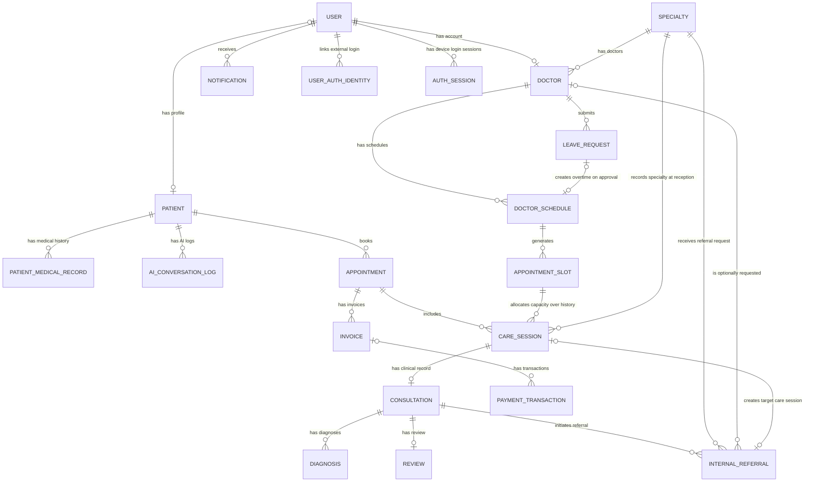
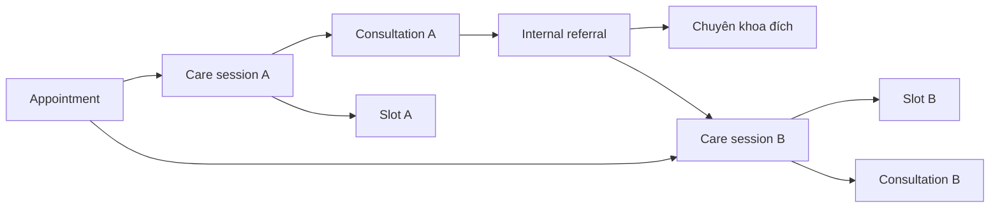

# Thiết kế cơ sở dữ liệu MediConnect



Cơ sở dữ liệu PostgreSQL gồm 20 bảng, phục vụ tài khoản, đặt lịch, khám theo chuyên khoa, chuyển khoa và thanh toán. Phiên khám nằm ở `care_sessions`; phiên đăng nhập nằm ở `auth_sessions`. Xác minh email và khôi phục mật khẩu dùng Redis.

Ký hiệu ERD: `||` = đúng một; `o|` hoặc `|o` = không hoặc một; `o{` = không hoặc nhiều. Slot có thể liên kết nhiều phiên trong lịch sử nhưng chỉ một phiên chưa hủy được chiếm chỗ. Các FK phụ được mô tả trong từ điển dữ liệu.

## 1. Tổng quan mô hình

### 1.1. Các khái niệm chính

| Khái niệm | Ý nghĩa trong thiết kế này |
|---|---|
| User | Tài khoản đăng nhập và quyền truy cập hệ thống. |
| User auth identity | Danh tính Google/Facebook đã liên kết với một tài khoản bệnh nhân. |
| Auth session | Một phiên đăng nhập trên trình duyệt hoặc ứng dụng, có vòng đời và refresh token độc lập. |
| Patient | Hồ sơ bệnh nhân; có thể tồn tại khi chưa có tài khoản. |
| Appointment | Hồ sơ đặt lịch online hoặc tiếp nhận tại quầy, làm đầu mối liên kết các care session và nhiều hóa đơn. |
| Doctor schedule | Một ca làm việc có ngày, giờ và bác sĩ cụ thể. |
| Appointment slot | Một khung giờ dự kiến trong ca, được cấp cho một care session. |
| Care session | Một phiên tiếp nhận và khám tại một chuyên khoa. Care session giữ slot, quản lý check-in, hàng chờ và tiến trình xử lý. Chuyển khoa tạo care session mới. |
| Consultation | Nội dung khám của một care session: ghi chú lâm sàng, đơn thuốc, chỉ định và thời điểm khóa hồ sơ. |
| Diagnosis | Một chẩn đoán được ghi trong consultation. Một consultation có thể có nhiều chẩn đoán. |
| Internal referral | Yêu cầu chuyển từ consultation hiện tại sang chuyên khoa khác; khi tiếp nhận thành công sẽ tạo care session đích. |

`CARE_SESSION` trong tài liệu này **là phiên khám tại một khoa**, không phải một lượt đến phòng khám bao trùm tất cả các khoa. Mô hình không sử dụng bảng `visits`.

### 1.2. Danh sách bảng

Tên số ít viết hoa dùng trên ERD; tên số nhiều `snake_case` dùng cho bảng PostgreSQL.

| Nhóm | Tên trên sơ đồ | Tên bảng PostgreSQL | Trách nhiệm |
|---|---|---|---|
| Tài khoản | USER | `users` | Xác thực, vai trò, trạng thái tài khoản. |
| Tài khoản | USER_AUTH_IDENTITY | `user_auth_identities` | Liên kết Google/Facebook với tài khoản bệnh nhân. |
| Tài khoản | AUTH_SESSION | `auth_sessions` | Quản lý đăng nhập nhiều thiết bị cho mọi vai trò. |
| Bệnh nhân | PATIENT | `patients` | Thông tin hành chính và liên hệ bệnh nhân. |
| Bệnh nhân | PATIENT_MEDICAL_RECORD | `patient_medical_records` | Tiền sử và dị ứng do bệnh nhân khai hoặc bác sĩ xác nhận. |
| Nhân sự chuyên môn | DOCTOR | `doctors` | Hồ sơ chuyên môn của bác sĩ. |
| Danh mục | SPECIALTY | `specialties` | Danh mục chuyên khoa. |
| Lịch | DOCTOR_SCHEDULE | `doctor_schedules` | Ca làm việc, công bố lịch. |
| Lịch | LEAVE_REQUEST | `leave_requests` | Hiện chỉ xử lý yêu cầu tăng ca của bác sĩ, một yêu cầu cho một ca. |
| Lịch | APPOINTMENT_SLOT | `appointment_slots` | Khung giờ khám trong một ca. |
| Tiếp nhận | APPOINTMENT | `appointments` | Hồ sơ đặt/tiếp nhận ban đầu. |
| Tiếp nhận | CARE_SESSION | `care_sessions` | Phiên khám tại một khoa, giữ slot và điều phối hàng chờ. |
| Khám bệnh | CONSULTATION | `consultations` | Nội dung khám gắn với một care session. |
| Khám bệnh | DIAGNOSIS | `diagnoses` | Danh sách chẩn đoán của consultation. |
| Khám bệnh | INTERNAL_REFERRAL | `internal_referrals` | Yêu cầu chuyển chuyên khoa và kết quả tiếp nhận. |
| Thanh toán | INVOICE | `invoices` | Khoản phải thu cho một appointment và các care session thuộc nó. |
| Thanh toán | PAYMENT_TRANSACTION | `payment_transactions` | Các giao dịch thu tiền, hoàn tiền và đối soát. |
| Phản hồi | REVIEW | `reviews` | Đánh giá sau khi hoàn thành consultation. |
| Thông báo | NOTIFICATION | `notifications` | Thông báo cho tài khoản người dùng. |
| AI | AI_CONVERSATION_LOG | `ai_conversation_logs` | Lưu phiên hội thoại và thao tác AI. |

## 2. Nguyên tắc mô hình hóa

### 2.1. Làm rõ liên kết care session, consultation và slot

Liên kết giữa care session, consultation và slot được quy định như sau:

- `care_sessions.appointment_slot_id` là nơi xác định slot được cấp cho phiên khám.
- `consultations.care_session_id` liên kết nội dung khám với phiên khám và có ràng buộc `UNIQUE`.
- Không lưu thêm `consultations.appointment_slot_id`; slot được truy qua care session.
- Không lưu thêm `internal_referrals.target_slot_id`; slot đích được truy qua care session nhận referral.

Consultation xác định slot qua care session, tránh lưu hai liên kết slot có thể mâu thuẫn.

### 2.2. Giữ hàng chờ trong care session

Sơ đồ không có bảng queue. Đề xuất lưu trạng thái chờ, số thứ tự, thứ tự gọi và thời điểm check-in trong `care_sessions`. Mỗi care session chỉ tham gia một hàng chờ tại một thời điểm. Khi chuyển khoa, tạo care session mới; khi quay lại sau cận lâm sàng, dùng lại care session cũ.

Hàng chờ của một bác sĩ được truy bằng đường `care_sessions → appointment_slots → doctor_schedules → doctors` và lọc các care session đang chờ. Không tạo thêm bảng queue chỉ để lưu lại cùng dữ liệu này.

### 2.3. Phân biệt nguồn phát sinh care session với appointment liên quan

Một appointment có nhiều care session: một care session ban đầu và các care session phát sinh khi chuyển khoa. Care session đích giữ cùng `appointment_id` với care session nguồn để tra bệnh nhân và tổng hợp chi phí xuyên suốt quá trình khám.

- `incoming_referral_id IS NULL`: care session ban đầu.
- `incoming_referral_id IS NOT NULL`: care session phát sinh do chuyển khoa.

Không lưu cột `origin` vì nguồn phát sinh đã xác định được từ liên kết referral.

`appointment_id` là ngữ cảnh chung; `incoming_referral_id` là nguyên nhân tạo care session đích. Hai trường có thể cùng có giá trị, nên **không áp dụng XOR giữa chúng**.

### 2.4. Khách vãng lai

Khi tiếp nhận khách vãng lai, y tá/nhân viên tiếp nhận đăng nhập hệ thống, tìm hoặc tạo patient và tạo appointment có `booking_source = WALK_IN`, sau đó tạo care session và cấp slot còn phù hợp. Bệnh nhân không cần có user; `patients.user_id` được để NULL. Appointment ở đây là đăng ký khám tại quầy, không có nghĩa bệnh nhân đã đặt trước.

Đăng ký online, kể cả qua AI, bắt buộc bệnh nhân đã đăng nhập user và thao tác trên patient của mình. `appointments.created_by` luôn có giá trị: là user bệnh nhân khi đặt online hoặc user nhân viên khi tiếp nhận tại quầy. Tên gọi y tá ở luồng tiếp nhận được ánh xạ vào quyền tiếp nhận hiện có (`RECEPTIONIST`), chưa thêm vai trò mới. `care_sessions.appointment_id` luôn bắt buộc ở cả hai luồng.

### 2.5. Phạm vi lưu trữ

Tài liệu có 20 bảng. Mã/token xác minh email, liên kết tài khoản và đặt lại mật khẩu lưu trong Redis. Audit log và phiên bản bổ sung bệnh án nằm ngoài phạm vi hiện tại; `ai_conversation_logs` chỉ lưu hội thoại AI.

### 2.6. Tài khoản và các phương thức đăng nhập

Email là định danh đăng nhập bắt buộc của `users`. Bệnh nhân có thể dùng email + mật khẩu hoặc Google; cấu trúc hỗ trợ Facebook khi triển khai sau này. Một user có thể dùng đồng thời mật khẩu và danh tính ngoài đã liên kết, không có cột `login_type` giới hạn tài khoản vào một cách đăng nhập duy nhất.

`password_hash = NULL` nghĩa là tài khoản chưa thiết lập mật khẩu, không phải mật khẩu rỗng. Chỉ tài khoản `PATIENT` được liên kết Google/Facebook; nhân viên vẫn đăng nhập bằng cơ chế email/mật khẩu. Mọi vai trò đều được quản lý nhiều phiên đăng nhập bằng `auth_sessions`.

Một patient profile không có user vẫn có thể tồn tại để phục vụ tiếp nhận. Việc gắn tài khoản mới với hồ sơ bệnh nhân có sẵn phải xác minh quyền sở hữu; không tự ghép các patient profile chỉ vì trùng email liên hệ.

## 3. Quan hệ và luồng dữ liệu

### 3.1. Bảng quan hệ chính

`0..1` nghĩa là không có hoặc có một; `0..N` nghĩa là không có hoặc có nhiều. Các FK bắt buộc/tùy chọn được mô tả theo chiều bản ghi con tham chiếu bản ghi cha.

| Bảng cha | Bảng con | Số bản ghi con của một cha | FK ở bảng con |
|---|---|---|---|
| `users` | `patients` | `0..1` | `user_id`, nullable, unique. |
| `users` | `doctors` | `0..1` | `user_id`, bắt buộc, unique. |
| `users` | `user_auth_identities` | `0..N` | `user_id`, bắt buộc; chỉ liên kết với user có role `PATIENT`. |
| `users` | `auth_sessions` | `0..N` | `user_id`, bắt buộc; mỗi phiên đăng nhập có vòng đời độc lập. |
| `patients` | `patient_medical_records` | `0..N` | `patient_id`, bắt buộc. |
| `patients` | `appointments` | `0..N` | `patient_id`, bắt buộc. |
| `specialties` | `doctors` | `0..N` | `specialty_id`, bắt buộc. |
| `doctors` | `doctor_schedules` | `0..N` | `doctor_id`, bắt buộc. |
| `doctors` | `leave_requests` | `0..N` | `doctor_id`, bắt buộc. |
| `doctor_schedules` | `appointment_slots` | `0..N` | `doctor_schedule_id`, bắt buộc. |
| `appointments` | `care_sessions` | `0..N` | `appointment_id`, bắt buộc theo mục 2. |
| `appointment_slots` | `care_sessions` | `0..N` trong lịch sử; tối đa một care session chiếm chỗ | `appointment_slot_id`, bắt buộc; có unique index có điều kiện. |
| `care_sessions` | `consultations` | `0..1` | `care_session_id`, bắt buộc, unique. |
| `consultations` | `diagnoses` | `0..N` | `consultation_id`, bắt buộc. |
| `consultations` | `internal_referrals` nguồn | `0..N` | `source_consultation_id`, bắt buộc. |
| `specialties` | `internal_referrals` | `0..N` | `target_specialty_id`, bắt buộc. |
| `doctors` | `internal_referrals` được chỉ định | `0..N` | `requested_doctor_id`, nullable. |
| `internal_referrals` | `care_sessions` đích | `0..1` | `incoming_referral_id`, nullable, unique. |
| `appointments` | `invoices` | `0..N` | `appointment_id`, bắt buộc, không unique. |
| `invoices` | `payment_transactions` | `0..N` | `invoice_id`, nullable chỉ khi chưa đối soát được hóa đơn. |
| `consultations` | `reviews` | `0..1` | `consultation_id`, bắt buộc, unique. |
| `users` | `notifications` | `0..N` | `user_id`, bắt buộc. |
| `patients` | `ai_conversation_logs` | `0..N` | `patient_id`, bắt buộc trong phiên chat đã xác định bệnh nhân. |

Appointment có thể chưa có care session trong bản nháp. API đặt lịch thành công phải tạo cả appointment, care session ban đầu và hóa đơn nếu nghiệp vụ yêu cầu, trong cùng giao dịch hoặc quy trình bảo đảm nhất quán.

### 3.2. Đặt lịch và khám thông thường

1. Admin công bố `doctor_schedule`; hệ thống tạo các `appointment_slots`.
2. Bệnh nhân chọn slot; hệ thống tạo `appointment` và care session ban đầu có `incoming_referral_id = NULL` giữ slot đó.
3. Tạo hóa đơn cho appointment. Chưa thanh toán thì hóa đơn chưa có giao dịch thành công.
4. Lễ tân check-in; care session chuyển sang chờ và được cấp số thứ tự.
5. Bác sĩ gọi bệnh nhân, bắt đầu khám; tạo consultation của care session.
6. Bác sĩ lưu nội dung khám và các diagnosis; hoàn tất thì khóa consultation và hoàn thành care session.
7. Bệnh nhân có thể tạo một review cho mỗi consultation đã hoàn thành.

### 3.3. Chuyển chuyên khoa nội bộ

Luồng chuyển khoa yêu cầu kiểm tra slot còn trống trong ngày, giữ chỗ, tạo phiên khám mới và đưa bệnh nhân vào hàng chờ khoa đích. Nếu hết slot thì vẫn ghi nhận yêu cầu để hỗ trợ đặt lịch sau.



Các mũi tên trong hình này diễn tả luồng nghiệp vụ. Hướng FK thực tế được quy định ở bảng quan hệ và phần chi tiết từng bảng.

- Consultation A phát sinh referral, ghi chuyên khoa đích và bác sĩ yêu cầu nếu có.
- Khi có slot phù hợp, tạo care session B cùng `appointment_id` với care session A và gắn `incoming_referral_id`.
- Care session B giữ slot B; việc cấp slot và tạo care session đích phải thực hiện cùng một giao dịch.
- Nội dung khám tại khoa B được lưu ở consultation B. Tạo consultation khi bác sĩ bắt đầu khám; session lưu phiên đã được tiếp nhận trước thời điểm này.
- Khi chưa có slot, referral ở trạng thái chờ; chưa có care session đích.
- Không ghi đè consultation A bằng kết quả của khoa B.
- Không tạo appointment mới khi referral, kể cả khi hỗ trợ đặt sang ngày khác; session đích tiếp tục thuộc appointment nguồn. Không có luồng quay lại bác sĩ nguồn sau referral trong phạm vi hiện tại.

Vòng `CARE_SESSION → CONSULTATION → INTERNAL_REFERRAL → CARE_SESSION` ở mức bảng là hợp lệ vì care session nguồn và care session đích là hai bản ghi khác nhau. Không lưu hai FK ngược chiều cùng biểu diễn care session đích: dùng `care_sessions.incoming_referral_id`, không thêm `internal_referrals.target_care_session_id`.

### 3.4. Phân biệt slot và hàng chờ

Slot xác định thời gian khám dự kiến và khả năng tiếp nhận. Trạng thái hàng chờ của care session xác định người đã đến và thứ tự gọi thực tế. Bệnh nhân đến trễ không tự động trở thành một lần đặt slot mới.

Database lưu thời điểm check-in, slot gốc và nhóm ưu tiên. Ngưỡng đến trễ là cấu hình nghiệp vụ, không có CHECK cố định theo số phút trong schema.

### 3.5. Đăng ký, đăng nhập và liên kết Google/Facebook

| Tình huống | Xử lý | Dữ liệu được tạo/cập nhật |
|---|---|---|
| Đăng ký email + mật khẩu, email chưa tồn tại | Tạo user chờ xác minh; gửi mã/token qua email. Sau xác minh mới kích hoạt và cấp phiên đăng nhập. | `users.password_hash`, `email_verified_at`, patient profile và `auth_sessions` khi đăng nhập. |
| Đăng ký bằng email đã tồn tại | Báo email đã được sử dụng; hướng dẫn đăng nhập hoặc Quên mật khẩu. Không ghi đè mật khẩu tài khoản hiện có. | Không tạo user/patient trùng. |
| Google trả về identity đã liên kết | Xác thực kết quả đăng nhập, tra bằng `(provider, provider_subject)`, kiểm tra user hoạt động và role hợp lệ. | Tạo `auth_sessions` mới; cập nhật identity `last_login_at`. |
| Google lần đầu, email chưa tồn tại | Xác thực danh tính nhà cung cấp; xác minh quyền sở hữu email bằng bằng chứng nhà cung cấp đáng tin cậy hoặc mã gửi email khi cần. Tạo tài khoản bệnh nhân. | User có `password_hash = NULL`, email đã xác minh; tạo patient, identity và phiên đăng nhập. |
| Google lần đầu, email trùng tài khoản bệnh nhân hiện có | Không tự liên kết chỉ vì email giống nhau. Yêu cầu xác thực lại tài khoản hiện có bằng mật khẩu khi email đã xác minh, hoặc mã/link gửi tới email tài khoản. Sau đó liên kết vào user cũ. | Tạo identity cho user cũ, giữ patient cũ; cấp phiên đăng nhập sau khi liên kết thành công. |
| Google trả email trùng tài khoản nhân viên | Từ chối liên kết ngoài do chức năng chỉ dành cho bệnh nhân; không tạo tài khoản thứ hai cùng email. | Không đổi role hoặc chủ sở hữu tài khoản. |
| Tài khoản Google thêm mật khẩu trong Settings | Yêu cầu phiên hợp lệ và xác minh lại gần thời điểm thao tác, qua email hoặc đăng nhập Google mới. | Đặt `password_hash` cho user hiện có; giữ identity. |
| Tài khoản Google dùng Quên mật khẩu | Gửi mã/token đến `users.email`, xác minh rồi đặt mật khẩu; sau đó cho đăng nhập lại. | Cập nhật mật khẩu, ghi nhận email đã xác minh và thu hồi các auth session cũ; không xóa identity. |
| Facebook sau này không cung cấp email hoặc chưa đủ bằng chứng xác minh | Yêu cầu nhập email và xác minh qua email trước khi tạo/liên kết tài khoản. | Không tạo user thiếu email; thông tin giao dịch OAuth đang chờ chỉ lưu tạm. |

Backend phải xác thực kết quả OAuth/OIDC phù hợp từng provider, gồm nguồn phát hành/ứng dụng nhận, hạn dùng và tính gắn kết với yêu cầu đăng nhập (state/nonce/PKCE theo luồng được chọn). Không nhận `provider_subject`, email hoặc cờ đã xác minh do client tự khai làm bằng chứng xác thực.

Sau khi identity đã liên kết, đăng nhập bằng khóa `(provider, provider_subject)`. Email nhà cung cấp thay đổi không tự đổi `users.email` hoặc chuyển identity sang user khác. Thay đổi email tài khoản là một luồng riêng có xác minh lại.

Tài khoản chờ xác minh trùng email cũng không được âm thầm kích hoạt chỉ do trùng email Google. Sau khi người dùng chứng minh sở hữu email, phải bảo đảm mật khẩu được đặt từ đăng ký chưa xác minh trước đó không trở thành thông tin truy cập cho người khác; có thể xóa mật khẩu chưa được xác nhận và yêu cầu chủ tài khoản thiết lập lại.

### 3.6. Xác minh tạm thời bằng Redis

Không tạo bảng `email_verification_challenges`. Redis lưu challenge ngắn hạn cho `REGISTRATION`, `LINK_IDENTITY`, `SET_PASSWORD`, `PASSWORD_RESET`, và các bước xác minh email nhà cung cấp khi cần.

Mỗi challenge gồm ID ngẫu nhiên, mục đích, email chuẩn hóa, `user_id` nếu đã có, hash/HMAC của mã hoặc token, số lần thử, thời điểm hết hạn và ngữ cảnh thao tác. Challenge liên kết phải gắn với provider/subject đang được backend xác thực, user đích và giao dịch OAuth; challenge thêm mật khẩu phải gắn với tài khoản và phiên yêu cầu tương ứng.

- Dùng TTL cho challenge và giới hạn thử/gửi lại theo email, mục đích và nguồn yêu cầu. Với OTP ngắn, ưu tiên HMAC có bí mật phía server để tránh dò toàn bộ mã từ dữ liệu lưu trữ.
- Kiểm tra mục đích và tiêu thụ challenge một lần bằng thao tác nguyên tử trong Redis. Không cho mã đăng ký dùng để đặt lại mật khẩu hoặc liên kết provider.
- Cập nhật user/identity/auth session trong transaction PostgreSQL sau khi xác minh hợp lệ. Redis và PostgreSQL không cùng một transaction; nếu thao tác DB thất bại sau khi mã đã dùng thì yêu cầu mã mới, không tự cho phép dùng lại mã đã tiêu thụ.
- Redis lỗi hoặc mất challenge thì yêu cầu xác minh lại. Tài khoản, liên kết danh tính và phiên đăng nhập đã lưu trong PostgreSQL không bị mất theo challenge.
- Luồng Quên mật khẩu trả thông báo trung tính về việc gửi hướng dẫn; không tự tạo tài khoản mới nếu email chưa tồn tại.

### 3.7. Đăng nhập trên nhiều thiết bị

Một lần đăng nhập thành công trên trình duyệt hoặc app tạo một `auth_sessions` mới với refresh token riêng. Các tab dùng chung phiên đăng nhập của cùng trình duyệt không nhất thiết là các phiên khác nhau. Không gộp phiên chỉ vì cùng IP, tên thiết bị hoặc user agent.

| Thao tác | Xử lý |
|---|---|
| Đăng nhập bằng mật khẩu/Google | Cấp access token chứa ID phiên đăng nhập và refresh token của phiên mới. |
| Refresh | Kiểm tra token, hạn phiên, user đang hoạt động và phiên chưa thu hồi; xoay refresh token và thay hash nguyên tử. |
| Đăng xuất thiết bị hiện tại | Thu hồi auth session hiện tại và xóa thông tin token phía client. |
| Đăng xuất thiết bị khác | Chỉ chủ tài khoản hoặc người có quyền mới được thu hồi phiên được chọn. |
| Đăng xuất tất cả | Thu hồi toàn bộ phiên của user, kể cả phiên thực hiện thao tác. |
| Quên/đặt lại mật khẩu | Cập nhật mật khẩu và thu hồi toàn bộ phiên cũ trong cùng transaction; yêu cầu đăng nhập lại. |
| Đổi mật khẩu đã có trong Settings | Xác minh lại; thu hồi các phiên cũ và cấp phiên mới cho thiết bị hiện tại sau khi thành công. |
| Khóa tài khoản | Cập nhật trạng thái user và thu hồi toàn bộ phiên; chặn cả đăng nhập và refresh. |

API được bảo vệ phải kiểm tra cả user và `auth_sessions` bằng ID phiên trong access token, không chỉ kiểm tra chữ ký token. Như vậy token còn hạn của phiên đã thu hồi cũng bị từ chối. Nếu cache kết quả kiểm tra thì phải có cơ chế vô hiệu hóa tương ứng; không hứa đăng xuất tức thời nếu chỉ chờ access token hết hạn.

Refresh token được bảo vệ trong cookie HttpOnly/Secure trên web và kho lưu bảo mật của app; cookie xác thực cần chính sách SameSite/CSRF phù hợp. Không đưa refresh token vào URL hoặc log. Việc thu hồi một phiên không xóa liên kết Google/Facebook và không tác động đến `care_sessions`.

## 4. Quy ước thiết kế chung

- Database dự kiến: PostgreSQL. PK dùng `UUID`, sinh bằng `gen_random_uuid()`.
- Tên bảng/cột vật lý dùng `snake_case`; Prisma dùng `PascalCase` cho model, `camelCase` cho trường, `@map` và `@@map` để ánh xạ tên.
- Enum và giá trị nghiệp vụ dùng `UPPER_SNAKE_CASE`.
- Thời điểm dùng `TIMESTAMPTZ`; ngày nghiệp vụ dùng `DATE`. Hiển thị và xác định ngày phòng khám theo `Asia/Ho_Chi_Minh`.
- Giá tiền dùng `NUMERIC(14,2)`, không dùng kiểu dấu phẩy động; tiền tệ mặc định `VND`.
- `created_at` mặc định thời điểm tạo. `updated_at` phải được cập nhật qua ứng dụng hoặc trigger; `DEFAULT now()` không tự cập nhật khi sửa.
- Ký hiệu trong các bảng: `NN` là `NOT NULL`; `UQ` là `UNIQUE`; `FK` là khóa ngoại; `NULL` là cho phép chưa có dữ liệu.
- Bảng nghiệp vụ đã phát sinh lịch sử ưu tiên đổi trạng thái hoặc vô hiệu hóa, không xóa dây chuyền hồ sơ khám và giao dịch tiền.
- Các ràng buộc liên quan dữ liệu ở bảng khác phải dùng FK phù hợp, transaction và khi cần trigger. Không dùng CHECK tham chiếu bảng khác để thay thế.
- Trạng thái lịch hẹn, care session, referral và thanh toán mô tả các đối tượng khác nhau. Không dùng trạng thái hóa đơn để quyết định bệnh án đã hoàn tất hay chưa.

## 5. Chi tiết từng bảng

### 5.1. `users`

**Mục đích:** định danh đăng nhập và phân quyền. Thông tin bệnh nhân chi tiết nằm ở `patients`, thông tin chuyên môn nằm ở `doctors`.

| Cột | Kiểu dữ liệu | Ràng buộc | Nội dung |
|---|---|---|---|
| `id` | UUID | PK, NN | Khóa tài khoản. |
| `full_name` | VARCHAR(255) | NN | Tên hiển thị tài khoản/nhân viên. |
| `email` | VARCHAR(255) | NN | Email đăng nhập bắt buộc, duy nhất không phân biệt hoa/thường. |
| `phone` | VARCHAR(20) | NULL | Số điện thoại liên hệ đã chuẩn hóa; không dùng thay email đăng nhập. |
| `password_hash` | VARCHAR(255) | NULL | Mật khẩu đã băm; rỗng khi tài khoản Google/Facebook chưa thêm mật khẩu. |
| `role` | ENUM | NN | `PATIENT`, `DOCTOR`, `RECEPTIONIST`, `ADMIN`. |
| `status` | ENUM | NN | `PENDING_VERIFICATION`, `ACTIVE`, `LOCKED`. |
| `email_verified_at` | TIMESTAMPTZ | NULL | Thời điểm hệ thống xác minh quyền sở hữu email tài khoản. |
| `created_at` | TIMESTAMPTZ | NN | Thời điểm tạo. |
| `updated_at` | TIMESTAMPTZ | NN | Thời điểm cập nhật. |

**Ràng buộc và index:** email không được rỗng; chuẩn hóa khoảng trắng và áp dụng unique index không phân biệt hoa/thường, ví dụ trên `lower(email)`. Không tự xóa dấu chấm hoặc phần `+suffix` trong email để gộp tài khoản. Phone là thông tin liên hệ, không mặc định cần unique. Một user có tối đa một patient profile và một doctor profile; quyền tạo/truy cập profile vẫn phải kiểm tra theo nghiệp vụ.

Tài khoản chưa xác minh email ở `PENDING_VERIFICATION`; tài khoản `LOCKED` không được đăng nhập hoặc refresh, kể cả khi còn identity Google/Facebook. Một tài khoản hoạt động phải có ít nhất một phương thức đăng nhập sử dụng được: mật khẩu hoặc identity ngoài. Ràng buộc này liên quan nhiều bảng nên kiểm tra trong transaction, không dùng CHECK tham chiếu bảng khác. Tài khoản nhân viên phải có mật khẩu vì đăng nhập ngoài chỉ dành cho bệnh nhân.

Google và email/mật khẩu cùng truy về một user. Email đã tồn tại thì luồng đăng ký phải báo đã sử dụng; không tự gán mật khẩu mới cho tài khoản đó. Tài khoản tạo từ Google có thể thêm mật khẩu trong Settings sau xác minh lại, hoặc qua Quên mật khẩu; liên kết Google vẫn giữ nguyên.

**Quy tắc:** mỗi tài khoản có đúng một vai trò trong `users.role`.

### 5.2. `patients`

**Mục đích:** hồ sơ hành chính của người được khám; có thể được lễ tân tạo trước khi người đó đăng ký tài khoản.

| Cột | Kiểu dữ liệu | Ràng buộc | Nội dung |
|---|---|---|---|
| `id` | UUID | PK, NN | Khóa bệnh nhân. |
| `user_id` | UUID | FK → users, NULL, UQ | Tài khoản của bệnh nhân, nếu có. |
| `patient_code` | VARCHAR(20) | NN, UQ | Mã bệnh nhân hiển thị. |
| `full_name` | VARCHAR(255) | NN | Họ tên người được khám. |
| `date_of_birth` | DATE | NULL | Ngày sinh. |
| `gender` | ENUM | NULL | `MALE`, `FEMALE`, `OTHER`. |
| `phone` | VARCHAR(20) | NULL | Số liên hệ phục vụ khám. |
| `email` | VARCHAR(255) | NULL | Email nhận liên hệ. |
| `address` | TEXT | NULL | Địa chỉ. |
| `emergency_contact_name` | VARCHAR(255) | NULL | Người liên hệ khẩn cấp. |
| `emergency_contact_phone` | VARCHAR(20) | NULL | Điện thoại người liên hệ. |
| `created_at` | TIMESTAMPTZ | NN | Thời điểm tạo. |
| `updated_at` | TIMESTAMPTZ | NN | Thời điểm cập nhật. |

**Quan hệ:** một patient có nhiều appointment, dữ liệu tiền sử và phiên hội thoại AI. Nội dung khám được truy từ appointment qua care session và consultation.

**Index:** `phone`, `full_name` phục vụ tìm hồ sơ; không mặc định đặt phone/email của patient là duy nhất vì nhiều người có thể dùng chung thông tin liên hệ.

**Nguồn dữ liệu:** thông tin ở `users` phục vụ tài khoản, thông tin ở `patients` phục vụ người được khám. Không tự động đồng bộ hai nhóm thông tin nếu chưa có quy tắc rõ ràng.

### 5.3. `patient_medical_records`

**Mục đích:** lưu từng mục tiền sử hoặc dị ứng. Không lưu lại toàn bộ nội dung consultation trong bảng này.

| Cột | Kiểu dữ liệu | Ràng buộc | Nội dung |
|---|---|---|---|
| `id` | UUID | PK, NN | Khóa mục tiền sử/dị ứng. |
| `patient_id` | UUID | FK → patients, NN | Bệnh nhân sở hữu dữ liệu. |
| `record_type` | ENUM | NN | `MEDICAL_HISTORY`, `ALLERGY`. |
| `name` | VARCHAR(255) | NN | Tên bệnh nền hoặc tác nhân gây dị ứng. |
| `description` | TEXT | NULL | Thông tin bổ sung. |
| `reaction` | TEXT | NULL | Phản ứng khi dị ứng. |
| `severity` | ENUM | NULL | `MILD`, `MODERATE`, `SEVERE`; dùng cho dị ứng. |
| `status` | ENUM | NN | `PENDING_CONFIRMATION`, `CONFIRMED`. |
| `created_by` | UUID | FK → users, NULL | Người nhập, nếu có tài khoản xác định. |
| `confirmed_by` | UUID | FK → doctors, NULL | Bác sĩ xác nhận. |
| `confirmed_in_consultation_id` | UUID | FK → consultations, NULL | Phiên khám xác nhận thông tin. |
| `confirmed_at` | TIMESTAMPTZ | NULL | Thời điểm xác nhận. |
| `created_at` | TIMESTAMPTZ | NN | Thời điểm tạo. |
| `updated_at` | TIMESTAMPTZ | NN | Thời điểm cập nhật. |

**Ràng buộc:** khi đã xác nhận phải có bác sĩ và thời điểm xác nhận; consultation xác nhận phải thuộc cùng bệnh nhân. Bệnh nhân không được tự sửa/xóa dữ liệu đã xác nhận. Các trường chỉ dành cho dị ứng phải rỗng đối với `MEDICAL_HISTORY`.

**Index:** `(patient_id, record_type, status)`. `record_type` phân biệt tiền sử và dị ứng trong cùng bảng.

### 5.4. `specialties`

**Mục đích:** danh mục chuyên khoa dùng cho bác sĩ, tìm kiếm và referral.

| Cột | Kiểu dữ liệu | Ràng buộc | Nội dung |
|---|---|---|---|
| `id` | UUID | PK, NN | Khóa chuyên khoa. |
| `code` | VARCHAR(20) | NN, UQ | Mã chuyên khoa. |
| `name` | VARCHAR(255) | NN, UQ | Tên chuyên khoa. |
| `description` | TEXT | NULL | Mô tả. |
| `is_active` | BOOLEAN | NN, mặc định true | Cho phép tiếp tục sử dụng. |
| `created_at` | TIMESTAMPTZ | NN | Thời điểm tạo. |
| `updated_at` | TIMESTAMPTZ | NN | Thời điểm cập nhật. |

**Quan hệ:** một specialty có nhiều doctors và nhiều yêu cầu referral hướng tới nó. Vô hiệu hóa phải xử lý các bác sĩ/lịch tương lai bị ảnh hưởng trước; không xóa chuyên khoa đang được lịch sử khám tham chiếu.

### 5.5. `doctors`

**Mục đích:** thông tin chuyên môn của một tài khoản bác sĩ.

| Cột | Kiểu dữ liệu | Ràng buộc | Nội dung |
|---|---|---|---|
| `id` | UUID | PK, NN | Khóa bác sĩ. |
| `user_id` | UUID | FK → users, NN, UQ | Tài khoản bác sĩ. |
| `specialty_id` | UUID | FK → specialties, NN | Chuyên khoa hiện tại. |
| `doctor_code` | VARCHAR(20) | NN, UQ | Mã bác sĩ. |
| `qualification` | TEXT | NULL | Trình độ chuyên môn. |
| `bio` | TEXT | NULL | Giới thiệu. |
| `avatar_url` | VARCHAR(500) | NULL | Ảnh đại diện. |
| `is_active` | BOOLEAN | NN, mặc định true | Trạng thái công tác. |
| `created_at` | TIMESTAMPTZ | NN | Thời điểm tạo. |
| `updated_at` | TIMESTAMPTZ | NN | Thời điểm cập nhật. |

**Ràng buộc:** mỗi bác sĩ thuộc một chuyên khoa hiện tại. Không đổi người dùng sở hữu hồ sơ đã có lịch sử. Khi đổi chuyên khoa phải xử lý lịch tương lai; care session đã tạo giữ chuyên khoa tại thời điểm tiếp nhận.

**Index:** `(specialty_id, is_active)`. Điểm đánh giá trung bình tính từ review của các consultation thuộc care session của bác sĩ; chưa cần cột cache.

### 5.6. `doctor_schedules`

**Mục đích:** lưu một ca làm việc của bác sĩ; đây là nguồn sinh slot.

| Cột | Kiểu dữ liệu | Ràng buộc | Nội dung |
|---|---|---|---|
| `id` | UUID | PK, NN | Khóa ca. |
| `doctor_id` | UUID | FK → doctors, NN | Bác sĩ làm việc. |
| `starts_at` | TIMESTAMPTZ | NN | Bắt đầu ca, gồm cả ngày. |
| `ends_at` | TIMESTAMPTZ | NN | Kết thúc ca. |
| `schedule_type` | ENUM | NN | `REGULAR`, `SHIFT`, `OVERTIME`. |
| `status` | ENUM | NN | `DRAFT`, `PUBLISHED`, `ABSENT`, `CANCELLED`. |
| `slot_duration_minutes` | SMALLINT | NN | Độ dài mặc định dùng khi sinh slot. |
| `created_by` | UUID | FK → users, NN | Người tạo ca. |
| `published_at` | TIMESTAMPTZ | NULL | Thời điểm công bố. |
| `created_at` | TIMESTAMPTZ | NN | Thời điểm tạo. |
| `updated_at` | TIMESTAMPTZ | NN | Thời điểm cập nhật. |

**Ràng buộc:** `starts_at < ends_at`; độ dài slot dương. Các ca được tính là còn hiệu lực của cùng bác sĩ không chồng thời gian. Có thể dùng exclusion constraint với khoảng thời gian nửa mở `[start, end)`; nếu dùng GiST cho UUID cần cấu hình hỗ trợ phù hợp như `btree_gist`.

**Nguồn dữ liệu:** không lưu thêm ngày/giờ dạng tách rời nếu đã dùng hai timestamp. Không đổi bác sĩ hoặc giờ ca đã có care session lịch sử; thay đổi lịch tương lai phải qua quy trình xử lý care session bị ảnh hưởng.

### 5.7. `leave_requests`

**Mục đích:** hiện chỉ theo dõi yêu cầu tăng ca của bác sĩ trước và sau khi được duyệt. Bảng dùng tên `leave_requests`; nghỉ phép, báo vắng và yêu cầu của nhân viên khác chưa triển khai.

| Cột | Kiểu dữ liệu | Ràng buộc | Nội dung |
|---|---|---|---|
| `id` | UUID | PK, NN | Khóa yêu cầu. |
| `doctor_id` | UUID | FK → doctors, NN | Bác sĩ gửi yêu cầu. |
| `request_type` | ENUM | NN, mặc định OVERTIME | Hiện chỉ nhận `OVERTIME`; các loại khác bổ sung sau. |
| `starts_at` | TIMESTAMPTZ | NN | Bắt đầu ca tăng ca được yêu cầu. |
| `ends_at` | TIMESTAMPTZ | NN | Kết thúc ca tăng ca được yêu cầu. |
| `reason` | TEXT | NN | Lý do. |
| `status` | ENUM | NN | `PENDING`, `APPROVED`, `REJECTED`, `CANCELLED`. |
| `created_schedule_id` | UUID | FK → doctor_schedules, NULL, UQ | Ca tăng ca được tạo khi duyệt. |
| `reviewed_by` | UUID | FK → users, NULL | Admin xét duyệt. |
| `reviewed_at` | TIMESTAMPTZ | NULL | Thời điểm duyệt/từ chối. |
| `rejection_reason` | TEXT | NULL | Lý do từ chối. |
| `created_at` | TIMESTAMPTZ | NN | Thời điểm gửi. |
| `updated_at` | TIMESTAMPTZ | NN | Thời điểm cập nhật. |

**Quan hệ:** một yêu cầu dành cho một ca. Khi được duyệt, yêu cầu tạo đúng một ca tăng ca; trước khi duyệt hoặc khi bị từ chối thì chưa có ca được tạo.

**Ràng buộc:** khoảng thời gian hợp lệ; duyệt yêu cầu và tạo ca cùng transaction. `created_schedule_id` phải thuộc cùng bác sĩ, ca có loại `OVERTIME`. Từ chối phải có lý do. Chưa hỗ trợ một yêu cầu sinh nhiều ca.

**Index:** `(doctor_id, starts_at)`, `(status, created_at)`.

### 5.8. `appointment_slots`

**Mục đích:** đại diện một khung giờ khám dự kiến trong ca làm việc.

| Cột | Kiểu dữ liệu | Ràng buộc | Nội dung |
|---|---|---|---|
| `id` | UUID | PK, NN | Khóa slot. |
| `doctor_schedule_id` | UUID | FK → doctor_schedules, NN | Ca chứa slot. |
| `starts_at` | TIMESTAMPTZ | NN | Bắt đầu slot. |
| `ends_at` | TIMESTAMPTZ | NN | Kết thúc slot. |
| `is_blocked` | BOOLEAN | NN, mặc định false | Khóa đặt mới do lý do vận hành. |
| `block_reason` | TEXT | NULL | Lý do khóa. |
| `created_at` | TIMESTAMPTZ | NN | Thời điểm tạo. |

**Ràng buộc:** thời gian hợp lệ, nằm trọn trong ca; các slot cùng ca không chồng lấn. Có thể đặt `UNIQUE (doctor_schedule_id, starts_at)` và exclusion constraint theo khoảng thời gian để ngăn cả trùng lẫn giao nhau.

Không lưu `doctor_id`, `specialty_id`, `slot_date` vì có thể truy từ ca hoặc tính từ timestamp. `is_blocked` chỉ là khóa vận hành, không phải trạng thái đã có người đặt.

**Slot có thể đặt** khi ca được công bố, slot chưa bị khóa, còn trong thời gian cho phép đặt và chưa có care session đang chiếm slot. Không lưu `is_available` để rồi phải đồng bộ với trạng thái care session.

### 5.9. `appointments`

**Mục đích:** lưu lần đăng ký/tiếp nhận ban đầu, làm ngữ cảnh cho care session ban đầu và các care session chuyển khoa.

| Cột | Kiểu dữ liệu | Ràng buộc | Nội dung |
|---|---|---|---|
| `id` | UUID | PK, NN | Khóa đăng ký. |
| `appointment_code` | VARCHAR(20) | NN, UQ | Mã tra cứu. |
| `patient_id` | UUID | FK → patients, NN | Người được khám. |
| `booking_source` | ENUM | NN | `PATIENT`, `AI_ASSISTANT`, `RECEPTIONIST`, `WALK_IN`. |
| `status` | ENUM | NN | `CONFIRMED`, `PENDING_RESOLUTION`, `CANCELLED`. |
| `reschedule_count` | SMALLINT | NN, mặc định 0 | Số lần bệnh nhân chủ động đổi lịch; tối đa theo chính sách. |
| `created_by` | UUID | FK → users, NN | User bệnh nhân đặt online hoặc user nhân viên tiếp nhận tại quầy. |
| `cancellation_reason` | TEXT | NULL | Lý do hủy. |
| `cancelled_by` | UUID | FK → users, NULL | Tài khoản thực hiện hủy, nếu có. |
| `cancelled_at` | TIMESTAMPTZ | NULL | Thời điểm hủy. |
| `created_at` | TIMESTAMPTZ | NN | Thời điểm tạo. |
| `updated_at` | TIMESTAMPTZ | NN | Thời điểm cập nhật. |

**Phân định trạng thái:** appointment theo dõi đăng ký và xử lý thay đổi lịch; care session theo dõi check-in/khám. Trạng thái tổng hợp như “đang khám”, “đã khám xong” trên màn hình được tính từ các care session và referral, không thêm các cột trạng thái trùng nếu chưa có nhu cầu.

Không lưu `doctor_id`, `specialty_id` hoặc `slot_id` ở appointment; thông tin lịch hiện tại lấy từ care session ban đầu. Care session chuyển khoa không ghi đè slot của care session ban đầu.

**Ràng buộc:** có tối đa một care session ban đầu (`incoming_referral_id IS NULL`) cho một appointment. Giới hạn đổi lịch là `0..2`; thay đổi do bác sĩ nghỉ/admin xử lý cần phân biệt với số lần bệnh nhân chủ động đổi. Hủy sau khi đã phát sinh khám/thu tiền phải có quy trình xử lý, không tự xóa consultation hay payment.

**Index:** `(patient_id, created_at)`, `(status, created_at)`.

### 5.10. `care_sessions`

**Mục đích:** phiên khám tại một khoa, là nơi cấp slot và theo dõi tiếp nhận/hàng chờ. Đây là đối tượng trung tâm của luồng khám trong mô hình hiện tại.

**Phạm vi:** giữ 13 cột cho đặt lịch, hàng chờ và referral. Các mốc sự kiện và lý do xử lý chi tiết được bổ sung khi triển khai nghiệp vụ tương ứng.

| Cột | Kiểu dữ liệu | Ràng buộc | Nội dung |
|---|---|---|---|
| `id` | UUID | PK, NN | Khóa care session. |
| `appointment_id` | UUID | FK → appointments, NN | Ngữ cảnh đăng ký và bệnh nhân. |
| `appointment_slot_id` | UUID | FK → appointment_slots, NN | Slot dự kiến đã cấp. |
| `specialty_id` | UUID | FK → specialties, NN | Chuyên khoa tại thời điểm tạo care session. |
| `incoming_referral_id` | UUID | FK → internal_referrals, NULL, UQ | Yêu cầu chuyển đã tạo care session này. |
| `status` | ENUM | NN | Các trạng thái mô tả bên dưới. |
| `checked_in_at` | TIMESTAMPTZ | NULL | Thời điểm tiếp nhận tại khoa. |
| `queue_date` | DATE | NULL | Ngày cấp số, theo giờ phòng khám. |
| `queue_number` | INTEGER | NULL | Số gọi hiển thị, không thay đổi khi đổi thứ tự. |
| `queue_position` | INTEGER | NULL | Thứ tự gọi có thể được điều phối. |
| `priority_type` | ENUM | NULL | `APPOINTMENT_ON_TIME`, `WALK_IN`, `APPOINTMENT_LATE`, `RETURNING_LAB`, `REFERRAL`. |
| `created_at` | TIMESTAMPTZ | NN | Thời điểm tạo. |
| `updated_at` | TIMESTAMPTZ | NN | Thời điểm cập nhật. |

**Trạng thái:** `SCHEDULED`, `WAITING`, `CALLED`, `SKIPPED`, `IN_CONSULTATION`, `WAITING_LAB`, `PAUSED`, `COMPLETED`, `INCOMPLETE`, `CANCELLED`, `NO_SHOW`.

**Ràng buộc chính:**

- Phân biệt phiên ban đầu và phiên chuyển khoa bằng việc `incoming_referral_id` có giá trị hay không.
- Partial unique index trên `appointment_id` khi `incoming_referral_id IS NULL` bảo đảm chỉ một care session ban đầu.
- Partial unique index trên `appointment_slot_id` khi `status <> CANCELLED` ngăn care session thường và care session referral cùng giữ một slot.
- Care session đã `COMPLETED` hoặc `NO_SHOW` vẫn giữ liên kết lịch sử với slot; không tái sử dụng slot đã qua để nhận đặt mới.
- Care session đích phải có cùng appointment với care session của consultation nguồn. FK thông thường chưa kiểm tra được điều này; cần kiểm tra trong giao dịch hoặc trigger.
- `specialty_id` phải khớp khoa được phân công khi cấp slot và khớp referral đích nếu có. Trường này là bản ghi lịch sử có chủ đích để không đổi nghĩa phiên khám khi bác sĩ đổi khoa sau này.
- `checked_in_at`, `queue_date`, `queue_number` phải được ghi nhất quán khi tiếp nhận; giá trị số thứ tự dương.
- Không lưu `arrival_status`; tính sớm/đúng giờ/trễ từ `checked_in_at` và thời điểm bắt đầu slot theo chính sách. Với walk-in không áp dụng phân loại trễ so với lịch hẹn đặt trước. Sau khi check-in, giữ nguyên giờ slot gốc và mốc check-in; điều phối bệnh nhân qua hàng chờ để kết quả so sánh không bị thay đổi do sửa lịch.

**Hàng chờ:** đánh số riêng theo bác sĩ và ngày. Hai bác sĩ có thể cùng có số 1 trong ngày; không dùng `UNIQUE (queue_date, queue_number)` toàn phòng khám. Bác sĩ được truy từ slot → schedule để giữ care session ở 13 cột.

Vì doctor_id không nằm trực tiếp ở care session, không thể tạo unique index `(doctor_id, queue_date, queue_number)` chỉ bằng JOIN. Việc cấp số phải dùng cùng một transaction và khóa theo cặp bác sĩ/ngày (ví dụ advisory transaction lock), sau đó kiểm tra/cấp số trong phạm vi đó. Mọi đường cấp hoặc sửa số phải tuân thủ khóa này; đây không phải unique constraint tự bảo vệ mọi lệnh ghi trực tiếp. Nếu cần DB cưỡng chế cả các đường ghi ngoài ứng dụng, bổ sung trigger kiểm tra dưới cùng cơ chế khóa. Giữ nguyên bác sĩ của ca/slot đã tiếp nhận để không làm đổi phạm vi số thứ tự lịch sử.

`queue_position` là thứ tự trong hàng của bác sĩ/ngày; không cần duy nhất toàn database. Khi hai vị trí bằng nhau, dùng thời điểm check-in và `id` để sắp xếp ổn định. Gọi hoặc sắp lại thứ tự phải khóa phạm vi hàng chờ tương ứng để hai nhân viên không gọi cùng một lượt.

**Index:** `appointment_id`, `(status, queue_date, queue_position)`, `appointment_slot_id`, `specialty_id`, cùng các unique index đã nêu. Các index phục vụ tìm bác sĩ qua slot và ca cũng cần có ở bảng liên quan.

**Các trường ngoài phạm vi hiện tại:** `called_at`, `lab_wait_started_at`, `paused_at`, `pause_reason`, `incomplete_reason`, `cancelled_at`, `cancellation_reason`. Bản đầu vẫn lưu trạng thái hiện tại nhưng chưa lưu đủ thời điểm/lý do cho từng lần chuyển trạng thái, chưa tự phát hiện chờ cận lâm sàng hoặc tạm dừng quá hạn theo SRS. `updated_at` không thay thế các mốc sự kiện này. Nếu cần lịch sử nhiều lần gọi/tạm dừng thì phải thiết kế lịch sử sự kiện thay vì chỉ thêm cột thời điểm gần nhất.

### 5.11. `consultations`

**Mục đích:** ghi nhận nội dung y khoa của một care session. Không tạo bảng consultation mới chỉ vì bệnh nhân chờ cận lâm sàng rồi quay lại cùng care session.

| Cột | Kiểu dữ liệu | Ràng buộc | Nội dung |
|---|---|---|---|
| `id` | UUID | PK, NN | Khóa nội dung khám. |
| `care_session_id` | UUID | FK → care_sessions, NN, UQ | Care session sở hữu bản ghi. |
| `clinical_notes` | TEXT | NULL | Triệu chứng và ghi chú lâm sàng. |
| `prescription` | JSONB | NULL | Mảng các thuốc được kê; mỗi phần tử lưu tên thuốc, liều dùng và hướng dẫn. |
| `lab_order_notes` | TEXT | NULL | Chỉ định cận lâm sàng. |
| `lab_result_notes` | TEXT | NULL | Ghi nhận kết quả khi bệnh nhân quay lại. |
| `follow_up_date` | DATE | NULL | Ngày tái khám được khuyến nghị. |
| `started_at` | TIMESTAMPTZ | NULL | Thời điểm bác sĩ thực sự bắt đầu khám. |
| `completed_at` | TIMESTAMPTZ | NULL | Thời điểm hoàn tất nội dung khám. |
| `locked_at` | TIMESTAMPTZ | NULL | Khóa hồ sơ khi có giá trị. |
| `created_at` | TIMESTAMPTZ | NN | Thời điểm tạo bản nháp/nội dung khám. |
| `updated_at` | TIMESTAMPTZ | NN | Thời điểm cập nhật. |

**Quan hệ:** consultation có nhiều diagnoses, tối đa một review và có thể phát sinh nhiều referrals. Bệnh nhân truy từ care session → appointment; bác sĩ truy từ care session → slot → schedule.

Không lưu thêm cột `diagnosis TEXT` vì sơ đồ đã chọn bảng `diagnoses`. Không lưu lại slot hay các trạng thái hàng chờ của care session.

**Đơn thuốc dạng JSONB:** `prescription` lưu một mảng, mỗi phần tử là một dòng thuốc. Không thêm bảng đơn thuốc hoặc bảng chi tiết thuốc ở bản hiện tại. `NULL` nghĩa là chưa ghi nhận đơn; `[]` nghĩa là đã ghi nhận không kê thuốc.

Các thuộc tính của một dòng thuốc:

| Thuộc tính JSON | Kiểu | Nội dung |
|---|---|---|
| `medicineName` | string | Tên thuốc, bắt buộc và không rỗng. |
| `strength` | string, tùy chọn | Hàm lượng/nồng độ kèm đơn vị. |
| `dosage` | string | Liều dùng mỗi lần do bác sĩ nhập. |
| `frequency` | string | Tần suất hoặc thời điểm sử dụng do bác sĩ nhập. |
| `durationDays` | integer, tùy chọn | Số ngày dùng; nếu có phải lớn hơn 0. |
| `quantity` | number | Tổng số lượng kê; phải lớn hơn 0. |
| `unit` | string | Đơn vị cấp thuốc, bắt buộc và không rỗng. |
| `instructions` | string, tùy chọn | Hướng dẫn bổ sung. |

Ví dụ cấu trúc với nội dung giả lập:

```json
[
  {
    "medicineName": "Thuốc mẫu A",
    "strength": "Hàm lượng do bác sĩ nhập",
    "dosage": "Liều mỗi lần do bác sĩ nhập",
    "frequency": "Tần suất do bác sĩ nhập",
    "durationDays": 5,
    "quantity": 10,
    "unit": "viên",
    "instructions": "Hướng dẫn sử dụng do bác sĩ nhập"
  }
]
```

Database kiểm tra giá trị là SQL NULL hoặc mảng JSON bằng `CHECK (prescription IS NULL OR jsonb_typeof(prescription) = 'array')`. Ứng dụng kiểm tra từng phần tử là object, đúng kiểu dữ liệu, đủ trường bắt buộc và các chuỗi bắt buộc không rỗng; không nhận JSON tùy ý chỉ vì đúng kiểu JSONB. Dùng SQL NULL cho trường hợp chưa ghi nhận, không dùng giá trị JSON `null`.

Tên thuốc và hướng dẫn được lưu theo nội dung tại thời điểm kê, không phụ thuộc danh mục thuốc có thể thay đổi sau này. Chưa cần GIN index nếu chỉ đọc/ghi toàn bộ đơn theo consultation. Khi hồ sơ đã khóa, quy tắc cấm sửa nội dung consultation áp dụng cả việc sửa từng phần tử trong JSONB.

**Khóa hồ sơ:** `locked_at` có giá trị thì cấm sửa/xóa nội dung consultation và diagnoses bằng luồng cập nhật thông thường. Không cần thêm `is_locked`. Hoàn tất care session và khóa consultation phải nhất quán trong cùng giao dịch. Bản hiện tại không hỗ trợ sửa bổ sung sau khóa; dịch vụ phải từ chối ghi đè hồ sơ đã khóa.

### 5.12. `diagnoses`

**Mục đích:** mỗi dòng là một chẩn đoán của một consultation, phù hợp việc đã tách bảng trong sơ đồ.

| Cột | Kiểu dữ liệu | Ràng buộc | Nội dung |
|---|---|---|---|
| `id` | UUID | PK, NN | Khóa chẩn đoán. |
| `consultation_id` | UUID | FK → consultations, NN | Nội dung khám chứa chẩn đoán. |
| `diagnosis_name` | VARCHAR(500) | NN | Tên/nội dung chẩn đoán do bác sĩ nhập. |
| `diagnosis_code` | VARCHAR(30) | NULL | Mã bệnh tùy chọn. |
| `is_primary` | BOOLEAN | NN, mặc định false | Chẩn đoán chính. |
| `notes` | TEXT | NULL | Diễn giải bổ sung. |
| `created_at` | TIMESTAMPTZ | NN | Thời điểm ghi. |
| `updated_at` | TIMESTAMPTZ | NN | Thời điểm cập nhật. |

**Ràng buộc:** partial unique index trên `consultation_id` khi `is_primary = true` bảo đảm tối đa một chẩn đoán chính. Tên chẩn đoán không được rỗng. Mã bệnh là tùy chọn; schema không có bảng danh mục mã bệnh.

**Ví dụ dữ liệu:** consultation C1 có hai dòng: một dòng `is_primary = true` cho chẩn đoán chính và một dòng `is_primary = false` cho chẩn đoán kèm theo. Không gộp nhiều mã/tên vào chuỗi phân cách dấu phẩy nếu đã dùng bảng này.

### 5.13. `internal_referrals`

**Mục đích:** lưu quyết định chuyển từ một consultation sang chuyên khoa khác, bao gồm cả yêu cầu chưa tìm được slot.

| Cột | Kiểu dữ liệu | Ràng buộc | Nội dung |
|---|---|---|---|
| `id` | UUID | PK, NN | Khóa referral. |
| `source_consultation_id` | UUID | FK → consultations, NN | Phiên khám phát sinh quyết định chuyển. |
| `target_specialty_id` | UUID | FK → specialties, NN | Chuyên khoa được yêu cầu tiếp nhận. |
| `requested_doctor_id` | UUID | FK → doctors, NULL | Bác sĩ được chỉ định khi lập yêu cầu, nếu có. |
| `reason` | TEXT | NN | Lý do chuyển. |
| `priority` | ENUM | NN | `NORMAL`, `URGENT`. |
| `status` | ENUM | NN | `PENDING`, `NO_SLOT_AVAILABLE`, `SCHEDULED`, `COMPLETED`, `CANCELLED`. |
| `cancelled_at` | TIMESTAMPTZ | NULL | Thời điểm hủy yêu cầu. |
| `cancellation_reason` | TEXT | NULL | Lý do hủy. |
| `created_at` | TIMESTAMPTZ | NN | Thời điểm lập. |
| `updated_at` | TIMESTAMPTZ | NN | Thời điểm cập nhật. |

**Các đường truy vấn:**

- Bệnh nhân và appointment: referral → source consultation → source care session → appointment → patient.
- Care session nhận chuyển: tìm `care_sessions.incoming_referral_id = referral.id`.
- Giờ khám đích: target care session → appointment slot.
- Bác sĩ thực tế tiếp nhận: target care session → slot → schedule → doctor.
- Nội dung khám đích: target care session → consultation có `care_session_id` tương ứng.

**Ràng buộc:** bác sĩ được yêu cầu phải thuộc khoa đích tại thời điểm chỉ định; care session đích phải đúng khoa và bác sĩ được chỉ định. `requested_doctor_id` diễn tả ý định chỉ định, còn người thực tế được xếp lịch lấy từ care session đích. Không âm thầm xếp người khác nếu đã chỉ định đích danh.

Đích phải là một care session mới, không phải chính source care session. Không được sửa các FK nguồn/đích để tạo chu trình giữa các bản ghi đã tồn tại. Khi care session đích bị hủy, phải cập nhật trạng thái referral tương ứng; việc sắp lại trước khi bắt đầu khám có thể tái sử dụng cùng care session đích và đổi slot có ghi vết.

**Index:** `source_consultation_id`, `(target_specialty_id, status, created_at)`. Không cần lưu thêm patient, appointment, target care session, target consultation và target slot đồng thời trên referral.

**Ưu tiên referral:** `NORMAL` và `URGENT` biểu diễn nhãn ưu tiên chuyển nội bộ; quy tắc xếp hàng thuộc tầng nghiệp vụ. Schema không triển khai phân loại cấp cứu.

### 5.14. `invoices`

**Mục đích:** lưu một khoản hoặc nhóm khoản phải thu trong appointment. Một appointment có nhiều invoice, mỗi invoice có nhiều giao dịch thu/hoàn; invoice mới tạo có thể chưa có payment. Mỗi hóa đơn có mã, số tiền và vòng đời riêng.

| Cột | Kiểu dữ liệu | Ràng buộc | Nội dung |
|---|---|---|---|
| `id` | UUID | PK, NN | Khóa hóa đơn. |
| `invoice_code` | VARCHAR(30) | NN, UQ | Mã đối chiếu chuyển khoản. |
| `appointment_id` | UUID | FK → appointments, NN | Đăng ký được tính phí; không unique vì một appointment có nhiều hóa đơn. |
| `currency` | CHAR(3) | NN, mặc định VND | Tiền tệ. |
| `charge_details` | JSONB | NN, mặc định [] | Các khoản phí chi tiết, nếu cần nhiều khoản mà vẫn giữ một bảng invoice. |
| `total_amount` | NUMERIC(14,2) | NN | Tổng phải thu theo các khoản phí. |
| `status` | ENUM | NN | `OPEN`, `VOID`. |
| `payment_grace_until` | TIMESTAMPTZ | NULL | Hạn đóng bù nếu áp dụng chính sách thanh toán thiếu. |
| `refund_requested_amount` | NUMERIC(14,2) | NULL | Số tiền cần hoàn đã được yêu cầu xử lý. |
| `refund_requested_at` | TIMESTAMPTZ | NULL | Thời điểm yêu cầu hoàn. |
| `refund_reason` | TEXT | NULL | Lý do hoàn. |
| `created_at` | TIMESTAMPTZ | NN | Thời điểm tạo. |
| `updated_at` | TIMESTAMPTZ | NN | Thời điểm cập nhật. |

**Cấu trúc khoản mục:** invoice dùng mảng `charge_details` dạng `{ description, quantity, unit_amount, care_session_id? }`. Đây là cấu trúc cần kiểm tra ở ứng dụng; `care_session_id` nằm trong JSON không được FK PostgreSQL bảo vệ. Các phần tử JSON phải được kiểm tra bởi dịch vụ hóa đơn.

**Ràng buộc:** tổng tiền không âm; tổng các khoản phí phải khớp `total_amount`, cập nhật cùng giao dịch. Sau khi đã thu tiền, không sửa tổng tiền tùy ý làm mất dấu thay đổi; bổ sung phí do referral phải có quy tắc và lịch sử rõ ràng.

**Index:** `(appointment_id, created_at)`. Các khoản phí của một care session có thể nằm trong hóa đơn tương ứng; tránh lập lại cùng khoản phí ở nhiều invoice. Tổng appointment lấy từ các hóa đơn còn nghĩa vụ thu; thanh toán/hoàn tiền luôn đối soát theo từng invoice, không tự phân bổ một giao dịch sang nhiều hóa đơn.

**Tổng hợp thanh toán cho từng hóa đơn:**

```text
collected_amount = tổng amount của giao dịch PAYMENT có status SUCCESS
refunded_amount  = tổng amount của giao dịch REFUND có status SUCCESS
net_received     = collected_amount - refunded_amount
balance          = total_amount - net_received
```

Không lưu thêm `amount_paid` ở bản đầu. Trạng thái hiển thị chưa thu/thu thiếu/đã thu/dư tiền được tính từ tổng giao dịch; lịch sử hoàn tiền và yêu cầu hoàn được hiển thị riêng. `VOID` chỉ hủy nghĩa vụ thu, không tự xóa giao dịch hay tự xem là đã hoàn tiền. Khoản đã hủy sau hoàn tiền không tiếp tục hiển thị là bệnh nhân còn nợ do công thức balance.

### 5.15. `payment_transactions`

**Mục đích:** lưu từng giao dịch thu hoặc hoàn tiền, kể cả giao dịch chưa xác định được hóa đơn.

| Cột | Kiểu dữ liệu | Ràng buộc | Nội dung |
|---|---|---|---|
| `id` | UUID | PK, NN | Khóa giao dịch. |
| `invoice_id` | UUID | FK → invoices, NULL | Hóa đơn đã ghép; rỗng khi chờ đối soát. |
| `provider` | ENUM | NN | `SEPAY`, `COUNTER`. |
| `external_transaction_id` | VARCHAR(100) | NULL | ID từ bên cung cấp. |
| `idempotency_key` | VARCHAR(100) | NN, UQ | Ngăn cùng một yêu cầu bị ghi nhận nhiều lần. |
| `transaction_type` | ENUM | NN | `PAYMENT`, `REFUND`. |
| `amount` | NUMERIC(14,2) | NN | Giá trị dương; loại giao dịch xác định chiều tiền. |
| `status` | ENUM | NN | `PENDING`, `SUCCESS`, `FAILED`, `PENDING_RECONCILIATION`. |
| `processed_by` | UUID | FK → users, NULL | Nhân viên thu/hoàn tại quầy. |
| `occurred_at` | TIMESTAMPTZ | NN | Thời điểm giao dịch thực tế. |
| `webhook_payload` | JSONB | NULL | Payload phục vụ đối soát SePay. |
| `reconciliation_note` | TEXT | NULL | Ghi chú đối soát. |
| `created_at` | TIMESTAMPTZ | NN | Thời điểm hệ thống ghi nhận. |
| `updated_at` | TIMESTAMPTZ | NN | Lần cập nhật kết quả/đối soát. |

**Ràng buộc:** `amount > 0`; unique `(provider, external_transaction_id)` với ID ngoài có giá trị. Giao dịch `SUCCESS` phải gắn hóa đơn; webhook chưa ghép được ở `PENDING_RECONCILIATION` và chưa được cộng vào tổng thu của bất kỳ invoice nào.

Không sửa số tiền hay loại của giao dịch thành công để giả lập hoàn tiền. Tạo bản ghi `REFUND` riêng. Kiểm tra tổng hoàn thành công cộng các lệnh hoàn đang chờ không vượt tiền đã thu; khóa invoice khi kiểm tra và tạo lệnh để tránh hoàn trùng đồng thời.

**Index:** `(invoice_id, status, transaction_type)`, `(status, created_at)`.

### 5.16. `reviews`

**Mục đích:** đánh giá nội dung khám/bác sĩ của một consultation.

| Cột | Kiểu dữ liệu | Ràng buộc | Nội dung |
|---|---|---|---|
| `id` | UUID | PK, NN | Khóa đánh giá. |
| `consultation_id` | UUID | FK → consultations, NN, UQ | Phiên khám được đánh giá. |
| `doctor_rating` | SMALLINT | NN | Điểm bác sĩ từ 1 đến 5. |
| `service_rating` | SMALLINT | NN | Điểm dịch vụ từ 1 đến 5. |
| `comment` | TEXT | NULL | Nhận xét. |
| `created_at` | TIMESTAMPTZ | NN | Thời điểm gửi. |

**Ràng buộc:** consultation phải hoàn tất; người gửi là tài khoản liên kết với patient của appointment tương ứng. Điểm nằm trong `[1,5]`. Không cần lặp lại patient/doctor trên review vì có thể truy theo consultation.

**Quy tắc:** một care session tương ứng tối đa một consultation và tối đa một review sau khi khám xong. Review tiếp tục tham chiếu consultation bằng FK unique, không cần lưu thêm care_session_id. Một appointment có nhiều phiên khám thì có thể có nhiều đánh giá; điểm bác sĩ và dịch vụ được ghi cho từng phiên.

### 5.17. `notifications`

**Mục đích:** thông báo trong ứng dụng tới tài khoản người dùng.

| Cột | Kiểu dữ liệu | Ràng buộc | Nội dung |
|---|---|---|---|
| `id` | UUID | PK, NN | Khóa thông báo. |
| `user_id` | UUID | FK → users, NN | Người nhận. |
| `notification_type` | VARCHAR(50) | NN | `APPOINTMENT`, `PAYMENT`, `REFERRAL`, `SCHEDULE`, `SYSTEM`... |
| `title` | VARCHAR(255) | NN | Tiêu đề. |
| `content` | TEXT | NN | Nội dung. |
| `reference_type` | VARCHAR(50) | NULL | Loại đối tượng được mở khi chọn thông báo. |
| `reference_id` | UUID | NULL | ID đối tượng. |
| `read_at` | TIMESTAMPTZ | NULL | Rỗng khi chưa đọc. |
| `created_at` | TIMESTAMPTZ | NN | Thời điểm tạo. |

**Ràng buộc:** hai trường reference cùng có giá trị hoặc cùng rỗng. Đây là tham chiếu đa loại phục vụ điều hướng, không phải FK thật; khi mở đích phải kiểm tra tồn tại và quyền truy cập. Không dùng thông báo làm nguồn dữ liệu quyết định lịch hẹn hay thanh toán.

Không cần `is_read` vì suy ra từ `read_at`. Index `(user_id, created_at)` và partial index cho thông báo chưa đọc. Bệnh nhân chưa có tài khoản cần kênh liên hệ khác; bảng này chỉ phục vụ in-app.

### 5.18. `ai_conversation_logs`

**Mục đích:** mỗi bản ghi chứa một phiên hội thoại AI của bệnh nhân, theo cách gộp một bảng trong sơ đồ.

| Cột | Kiểu dữ liệu | Ràng buộc | Nội dung |
|---|---|---|---|
| `id` | UUID | PK, NN | Khóa phiên chat. |
| `patient_id` | UUID | FK → patients, NN | Bệnh nhân sở hữu hội thoại. |
| `messages` | JSONB | NN, mặc định [] | Danh sách tin nhắn và thông tin tool call. |
| `started_at` | TIMESTAMPTZ | NN | Bắt đầu phiên chat. |
| `ended_at` | TIMESTAMPTZ | NULL | Kết thúc phiên. |
| `created_at` | TIMESTAMPTZ | NN | Thời điểm tạo bản ghi. |
| `updated_at` | TIMESTAMPTZ | NN | Thời điểm bổ sung nội dung. |

**Cấu trúc một phần tử `messages`:** `message_id`, `role`, `content`, `created_at`; khi có thao tác AI thì bổ sung `intent`, `confidence`, `tool_call_id`, `tool_name`, `tool_input`, `tool_output`, `confirmation_message_id`.

Role dùng `USER`, `ASSISTANT`, `SYSTEM`, `TOOL`. Tool call liên quan thay đổi dữ liệu phải có xác nhận hợp lệ và kiểm tra quyền ở dịch vụ nghiệp vụ; nội dung chat ghi “đã xác nhận” không tự nó là quyền thực thi.

**Lưu trữ hội thoại:** bổ sung tin nhắn phải có kiểm soát ghi đồng thời để không ghi đè mất dữ liệu. Cần giới hạn kích thước/thời lượng một phiên chat. Index `(patient_id, started_at)`.

### 5.19. `user_auth_identities`

**Mục đích:** lưu danh tính ngoài được liên kết với user bệnh nhân. Một user có thể có mật khẩu đồng thời với Google và Facebook. Bảng không lưu phương thức `PASSWORD`; mật khẩu thuộc `users.password_hash`.

| Cột | Kiểu dữ liệu | Ràng buộc | Nội dung |
|---|---|---|---|
| `id` | UUID | PK, NN | Khóa danh tính liên kết. |
| `user_id` | UUID | FK → users, NN | Tài khoản sở hữu danh tính. |
| `provider` | ENUM | NN | `GOOGLE`, `FACEBOOK`; Facebook chuẩn bị cho triển khai sau. |
| `provider_subject` | VARCHAR(255) | NN | ID ổn định do provider xác thực trả về, ví dụ subject Google; không dùng email thay thế. |
| `provider_email` | VARCHAR(255) | NULL | Email provider trả về gần nhất; Facebook có thể không trả email. |
| `provider_email_verified` | BOOLEAN | NN, mặc định false | Bằng chứng xác minh email do provider cung cấp; false nếu không có bằng chứng. |
| `linked_at` | TIMESTAMPTZ | NN | Thời điểm liên kết với user. |
| `last_login_at` | TIMESTAMPTZ | NULL | Lần đăng nhập thành công gần nhất qua identity này. |

**Khóa và index:** `UNIQUE (provider, provider_subject)` ngăn một danh tính ngoài thuộc nhiều user; `UNIQUE (user_id, provider)` giới hạn mỗi user tối đa một Google và một Facebook. Không đặt unique trên `provider_email`; email tài khoản chuẩn và duy nhất nằm ở `users.email`.

**Ràng buộc nghiệp vụ:** chỉ liên kết với user `PATIENT`. Kiểm tra role, trạng thái tài khoản, xác minh quyền sở hữu và tạo identity trong transaction; CHECK của một bảng không thay được việc kiểm tra role ở bảng khác. Không tự đổi role của tài khoản đã tồn tại khi đăng nhập OAuth.

`provider_email_verified` là thông tin từ nhà cung cấp; `users.email_verified_at` là kết quả hệ thống xác minh email tài khoản. Một provider không xác nhận email vẫn có thể liên kết sau khi hệ thống xác minh qua email. Không suy ra hai trường luôn tương đương.

**Bảo toàn tài khoản:** không tự đổi `user_id` của identity đã liên kết. Nếu hỗ trợ gỡ liên kết trong Settings, yêu cầu xác thực lại và bảo đảm user vẫn còn ít nhất một phương thức đăng nhập hợp lệ; không gỡ Google cuối cùng khi chưa có mật khẩu hoặc provider khác. Không cần lưu access/refresh token của Google/Facebook trong bảng này nếu chỉ dùng provider để đăng nhập; refresh token nội bộ thuộc `auth_sessions`.

### 5.20. `auth_sessions`

**Mục đích:** quản lý các phiên đăng nhập độc lập trên web/app cho mọi vai trò. Không liên quan đến `care_sessions`, trạng thái khám hay hàng chờ.

| Cột | Kiểu dữ liệu | Ràng buộc | Nội dung |
|---|---|---|---|
| `id` | UUID | PK, NN | ID phiên, được gắn vào access token để kiểm tra thu hồi. |
| `user_id` | UUID | FK → users, NN | Tài khoản đang đăng nhập. |
| `refresh_token_hash` | VARCHAR(255) | NN, UQ | Hash refresh token nội bộ hiện hành; không lưu token rõ. |
| `client_type` | ENUM | NN | `WEB`, `MOBILE`. |
| `device_name` | VARCHAR(255) | NULL | Tên thiết bị để hiển thị ở Settings. |
| `user_agent` | TEXT | NULL | Thông tin trình duyệt/app, không phải bằng chứng định danh thiết bị. |
| `ip_address` | INET | NULL | IP gần nhất của phiên, dùng hiển thị/kiểm tra. |
| `created_at` | TIMESTAMPTZ | NN | Thời điểm đăng nhập. |
| `last_active_at` | TIMESTAMPTZ | NN | Hoạt động gần nhất; ban đầu bằng thời điểm tạo, cập nhật theo khoảng thời gian. |
| `expires_at` | TIMESTAMPTZ | NN | Hạn tối đa của phiên và refresh token theo chính sách server. |
| `revoked_at` | TIMESTAMPTZ | NULL | Thời điểm bị thu hồi; có giá trị thì không được sử dụng tiếp. |
| `revocation_reason` | VARCHAR(50) | NULL | Ví dụ `LOGOUT`, `LOGOUT_ALL`, `REMOTE_LOGOUT`, `PASSWORD_RESET`, `PASSWORD_CHANGED`, `ACCOUNT_LOCKED`. |

**Quan hệ:** một user có `0..N` auth session; mỗi auth session thuộc đúng một user. Không đặt `UNIQUE(user_id)` hoặc unique theo thiết bị/IP. Không bắt buộc nối auth session tới identity: đăng nhập bằng mật khẩu hoặc provider đều tạo cùng loại phiên nội bộ.

**Trạng thái:** phiên hợp lệ khi `revoked_at IS NULL`, `expires_at > now()` và user vẫn hoạt động. Không thêm `is_active` lưu trùng. CHECK `expires_at > created_at`; `last_active_at >= created_at`; nếu có `revoked_at` thì không trước thời điểm tạo và phải có lý do thu hồi.

**Index:** `(user_id, created_at)` để hiển thị thiết bị; index trên `expires_at` phục vụ dọn phiên hết hạn; có thể thêm partial index trên `(user_id, expires_at)` với điều kiện `revoked_at IS NULL`. Không dùng `now()` trong điều kiện partial index để biểu diễn chưa hết hạn.

**Refresh và thu hồi:** khóa bản ghi hoặc dùng compare-and-swap trên hash cũ khi refresh. Chỉ một yêu cầu được thay hash thành công; client phối hợp để không gửi nhiều yêu cầu refresh cạnh tranh. Không chấp nhận lại token cũ sau khi xoay. Khi thu hồi, không cần xóa bản ghi ngay; giữ thời điểm/lý do theo chính sách lưu trữ. Bảng chỉ lưu hash token hiện tại, nên không tự nhận là đã có lịch sử toàn bộ token hoặc cơ chế phát hiện mọi trường hợp tái sử dụng token cũ.

## 6. Các ràng buộc xuyên bảng và giao dịch

### 6.1. Đặt lịch và chống trùng slot

Một transaction đặt lịch phải kiểm tra ca công bố, bác sĩ hoạt động, slot hợp lệ và tạo care session giữ chỗ. Unique index trên slot của care session còn chiếm chỗ là lớp bảo vệ cuối cùng. Không chỉ chạy SELECT xem trống rồi INSERT mà thiếu ràng buộc chống cạnh tranh.

Đặt trực tiếp, qua AI, tại quầy và referral đều phải đi qua cùng cơ chế cấp slot. Khi đổi slot, cập nhật care session và số lần đổi theo đúng nguồn yêu cầu; lưu lại slot cũ/mới trong cơ chế ghi vết. Không sửa consultation cũ để phù hợp với lịch mới.

### 6.2. Tạo referral và care session đích

Thứ tự tạo thông thường là source care session → source consultation → referral → target care session. Vì FK từ referral về source consultation đã tồn tại và target care session được tạo sau, vòng ở mức bảng không gây yêu cầu hai bản ghi chưa tồn tại phải đồng thời tham chiếu nhau.

Nếu có slot: khóa/kiểm tra tài nguyên, tạo target care session, cập nhật referral sang `SCHEDULED` trong một transaction. Nếu hết slot: giữ referral ở `NO_SLOT_AVAILABLE`. Khi sắp lịch lại, kể cả sang ngày khác, dùng appointment cũ; phí phát sinh có thể tạo invoice khác thuộc appointment đó. Không tạo luồng quay lại bác sĩ nguồn.

### 6.3. Gọi khám, tạm dừng và hoàn tất

Chuyển trạng thái phải kiểm tra trạng thái cũ trong cùng giao dịch để tránh gọi hoặc bắt đầu hai lần. Khi gọi khám, chỉ chọn care session đủ điều kiện; người đến sớm chưa tự động được hưởng ưu tiên trước giờ hẹn.

Bỏ qua chuyển sang `SKIPPED`; gọi lại đưa vào vị trí được chính sách cho phép. Chờ cận lâm sàng giữ nguyên care session/consultation và cập nhật trạng thái. Bản đầu chưa tự xử lý quá hạn; khi triển khai phải bổ sung mốc bắt đầu chờ/tạm dừng phù hợp, không suy ra từ `updated_at`. Hoàn tất cập nhật care session và khóa consultation/diagnoses cùng nhau.

### 6.4. Thu tiền và webhook

Webhook lặp không tạo giao dịch mới nếu cùng external ID/idempotency key. Giao dịch chưa ghép được hóa đơn vẫn được lưu để đối soát. Sau khi ghép thành công phải bảo đảm chỉ cộng vào tổng thu đúng một lần.

Hủy appointment không tự hủy dấu vết tiền đã nhận. Phân biệt hủy nghĩa vụ thu, yêu cầu hoàn, lệnh hoàn đang chờ và hoàn tiền thành công.

### 6.5. Bảo toàn lịch sử

Các FK từ care session, consultation, diagnosis, referral, invoice và payment tới dữ liệu đã sử dụng nên ngăn xóa bản ghi cha khi còn tham chiếu. Danh mục bác sĩ/chuyên khoa được vô hiệu hóa bằng trạng thái. Giữ ca/slot đã có lịch sử; không dùng `ON DELETE CASCADE` cho toàn bộ chuỗi khám và thanh toán.

Các nghiệp vụ cần ghi vết đầy đủ về sau gồm tạo/đổi/hủy lịch, đổi trạng thái khám, sửa nội dung, xác nhận tiền sử, phê duyệt yêu cầu, đối soát và hoàn tiền. Audit log bất biến nằm ngoài phạm vi schema hiện tại; AI log và updated_at không thay thế lịch sử nghiệp vụ.

### 6.6. Nhất quán tài khoản, danh tính và phiên đăng nhập

Tạo user/patient/identity và cấp auth session phải kiểm soát bằng transaction. Hai callback Google hoặc hai yêu cầu đăng ký cùng email có thể chạy đồng thời: unique email và unique `(provider, provider_subject)` là ràng buộc cuối; khi xung đột phải đọc lại trạng thái, tiếp tục yêu cầu liên kết có xác minh nếu cần, không tự gộp hoặc chuyển chủ sở hữu identity.

Khi liên kết, chỉ cập nhật đúng tài khoản đã được xác minh trong challenge; không dùng email/ID đích do client thay đổi sau bước xác minh. Thao tác thêm/gỡ phương thức đăng nhập nên khóa user để hai thao tác đồng thời không làm mất tất cả phương thức.

Tạo hoặc refresh auth session phải tuần tự hóa với thao tác khóa tài khoản/đặt lại mật khẩu, bằng khóa user hoặc cơ chế kiểm tra cạnh tranh tương đương trong transaction. Như vậy không phát sinh phiên mới từ dữ liệu xác thực cũ ngay sau khi quy trình thu hồi tất cả vừa hoàn tất.

Đặt lại mật khẩu và thu hồi phiên cũ thực hiện cùng transaction PostgreSQL. Challenge Redis tiêu thụ một lần trước đó không thay thế các ràng buộc này. Thêm mật khẩu lần đầu sau xác minh hợp lệ không tạo user mới và không xóa Google/Facebook đã liên kết.

## 7. Ví dụ dữ liệu liên kết

Ví dụ dưới đây dùng ID ngắn để minh họa; database thực tế dùng UUID.

| Bản ghi | Dữ liệu liên kết chính | Ý nghĩa |
|---|---|---|
| `appointments A1` | `patient_id = P1` | Bệnh nhân P1 đăng ký khám. |
| `care_sessions S1` | `appointment_id = A1`, `incoming_referral_id = NULL`, `slot_id = T1` | Care session đầu tại khoa A. `slot_id` ở ví dụ là viết tắt của `appointment_slot_id`. |
| `consultations C1` | `care_session_id = S1` | Nội dung bác sĩ khoa A khám. |
| `internal_referrals R1` | `source_consultation_id = C1`, `target_specialty_id = K2` | Bác sĩ yêu cầu chuyển sang khoa B. |
| `care_sessions S2` | `appointment_id = A1`, `incoming_referral_id = R1`, `slot_id = T2` | Care session mới tại khoa B, có slot riêng. |
| `consultations C2` | `care_session_id = S2` | Nội dung khám của khoa B. |
| `invoices I1` | `appointment_id = A1` | Hóa đơn phí khám ban đầu. |
| `invoices I2` | `appointment_id = A1` | Hóa đơn khoản phí phát sinh, vẫn thuộc A1. |
| `payment_transactions TX1` | `invoice_id = I1`, `type = PAYMENT`, `status = SUCCESS` | Một lần thu tiền. |
| `payment_transactions TX2` | `invoice_id = I1`, `type = PAYMENT`, `status = SUCCESS` | Thu bổ sung lần hai cho I1. |
| `payment_transactions TX3` | `invoice_id = I1`, `type = REFUND`, `status = SUCCESS` | Hoàn tiền thuộc I1 nếu có, không tạo invoice mới chỉ để ghi giao dịch hoàn. |

Tra care session B không làm thay đổi care session A. Referral chưa tìm được slot sẽ có R1 nhưng chưa có S2/C2. Một consultation có thể phát sinh thêm referral khác; mọi đích phải là care session mới để không tạo vòng dữ liệu quay về nguồn.

## 8. Cấu hình và triển khai

### 8.1. Tệp cấu hình

| Tệp | Trách nhiệm |
|---|---|
| `apps/api/prisma/schema.prisma` | 20 model, enum, PK/FK, unique đầy đủ và index thông thường. |
| `apps/api/prisma/constraints.sql` | SQL bổ sung cho unique theo điều kiện, email không phân biệt hoa/thường, chống chồng thời gian và CHECK. Phải ghép vào migration khởi tạo. |
| `apps/api/prisma.config.ts` | Đường dẫn schema/migration và biến kết nối PostgreSQL của Prisma 7. |
| `apps/api/src/database/prisma.service.ts` | Prisma Client qua adapter PostgreSQL dùng cấu hình API. |
| `apps/api/.env.example` | Mẫu DATABASE_URL và SHADOW_DATABASE_URL; không chứa thông tin kết nối thật. |
| `apps/api/prisma/README.md` | Hướng dẫn tạo, bổ sung SQL và chạy migration thủ công. |

`DATABASE_URL` kết nối database ứng dụng. `SHADOW_DATABASE_URL` tùy chọn chỉ trỏ tới database phát triển riêng có thể xóa/tạo lại; không trỏ vào database ứng dụng. Migration dùng `btree_gist` để chống chồng khoảng thời gian. Không dùng `db push` thay cho migration có SQL bổ sung.

### 8.2. Phân tầng ràng buộc

| Nơi thực thi | Ràng buộc |
|---|---|
| Prisma schema | Kiểu dữ liệu, nullability, PK, FK, full unique, enum và index thông thường. |
| SQL trong migration | Unique `lower(email)`; một care session ban đầu/appointment; một session chưa hủy/slot; một chẩn đoán chính; chống chồng ca/slot; kiểm tra khoảng thời gian, số tiền, điểm và kiểu mảng JSON. |
| Dịch vụ nghiệp vụ và transaction | Quyền truy cập, role khi liên kết OAuth, cấp số theo bác sĩ/ngày, slot nằm trong ca, cùng bệnh nhân/appointment khi referral, chống vòng referral, khóa hồ sơ, bảo toàn lịch sử ca/slot, tổng hóa đơn và giới hạn hoàn tiền. |

Các ràng buộc liên bảng thuộc tầng dịch vụ chưa được thực thi chỉ bằng schema. API cần triển khai kiểm tra và khóa cạnh tranh tương ứng trước khi nhận dữ liệu nghiệp vụ. `constraints.sql` không chứa trigger thay thế các dịch vụ đó.

Email có unique expression index, không có selector Prisma `findUnique({ email })`; dùng truy vấn không phân biệt hoa/thường và xử lý lỗi unique khi tạo tài khoản đồng thời. `updatedAt` do Prisma Client cập nhật; lệnh SQL trực tiếp phải tự cập nhật `updated_at`.

### 8.3. Phạm vi hiện tại

- Một user có một vai trò; OAuth chỉ dành cho bệnh nhân; auth session áp dụng cho mọi vai trò.
- `care_sessions` có 13 cột, đánh số hàng chờ theo bác sĩ/ngày; chưa lưu mốc chờ/tạm dừng để xử lý quá hạn tự động.
- Appointment có nhiều hóa đơn; mỗi hóa đơn có nhiều giao dịch thu/hoàn tiền.
- Yêu cầu lịch hiện chỉ hỗ trợ bác sĩ tăng ca, một yêu cầu cho một ca.
- Xác minh email dùng Redis; TTL và chính sách token thuộc cấu hình logic.
- Chưa có audit log bất biến, cơ chế bổ sung bệnh án sau khóa, luồng quay lại bác sĩ nguồn hoặc quản lý kho thuốc.

### 8.4. Migration thủ công

Chạy các lệnh từ `mediConnect/apps/api` sau khi cấu hình `.env` cho môi trường phát triển:

```powershell
npm run prisma:format
npm run prisma:validate
npm run prisma:migrate:create -- --name init_mediconnect
```

Mở migration vừa tạo, ghép toàn bộ `prisma/constraints.sql` vào cuối `migration.sql` đúng một lần, sau các lệnh tạo bảng và FK. Kiểm tra SQL rồi mới chạy:

```powershell
npm run prisma:migrate:dev
npm run prisma:generate
npm run prisma:migrate:status
```

`--create-only` vẫn kết nối database phát triển/shadow và có thể xử lý lịch sử migration hiện hữu; không phải lệnh offline. Nếu database đã có bảng/dữ liệu mà chưa có migration tương ứng, cần baseline trước; không chấp nhận reset để khởi tạo cưỡng bức. Các môi trường triển khai dùng migration đã commit và `prisma:migrate:deploy`, không dùng `migrate dev`.
